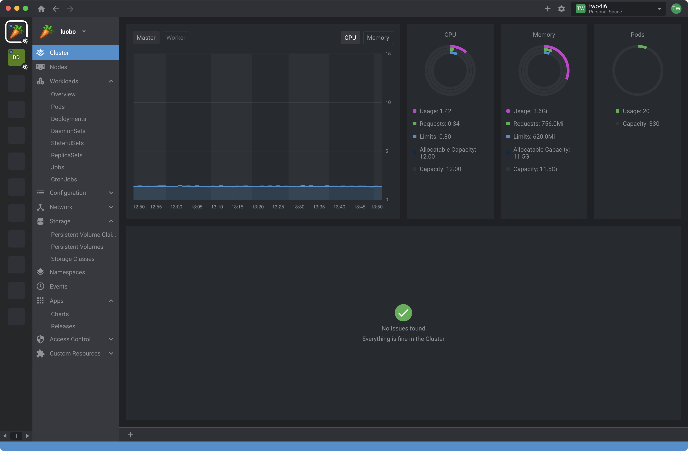
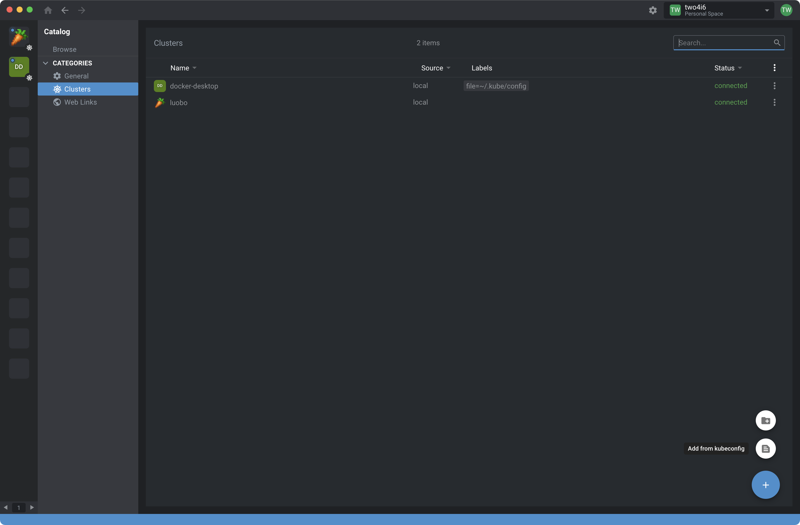
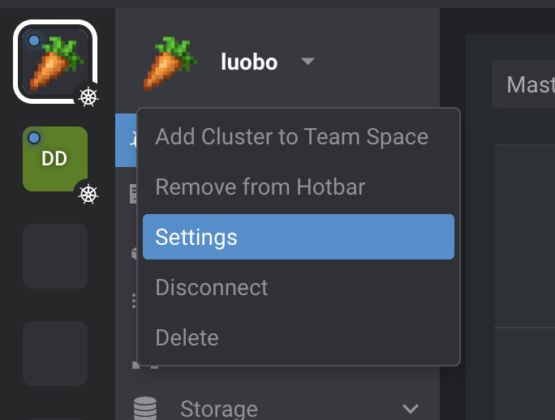
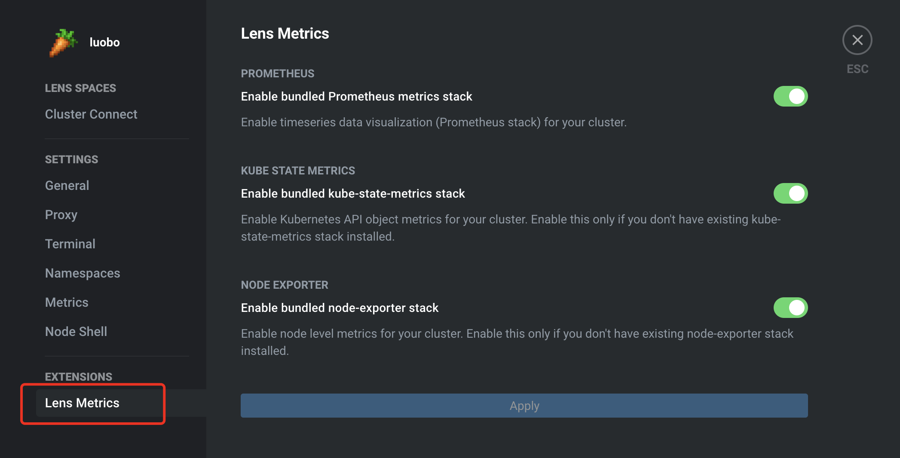

# Lens

[Lens](https://k8slens.dev) 是一个开源的用于管理Kubernetes集群的IDE



---

## 安装Lens

### 添加集群



在 ```Home > Clusters``` 点击右下角的 +， 选择 ```Add from kubeconfig```

输入你master节点的 ```kubeconfig```信息.

以 ```k3s``` 为列，```kubeconfig``` 信息位于 ```/etc/rancher/k3s/k3s.yaml```.

> 如果不在host上运行，注意需要修改对应的server地址.

### 配置metric

刚添加的集群需要安装相应的插件来启动metric.

需要在 ```Setting > Lens Metrics``` 中开启相应的插件





---

## 