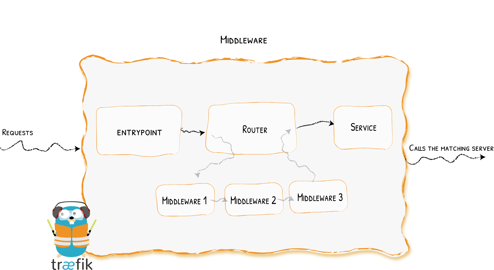
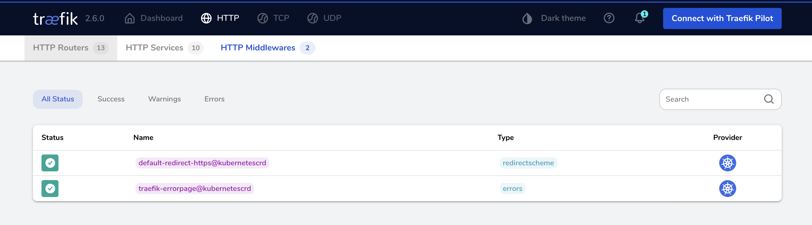

# 🦦 traefik 中间件

[Middleware (中间件)](https://doc.traefik.io/traefik/v2.3/middlewares/overview/) 中间件是 Traefik2.x 中一个非常有特色的功能，我们可以根据自己的各种需求去选择不同的中间件来满足服务，Traefik 官方已经内置了许多不同功能的中间件，其中一些可以修改请求，头信息，一些负责重定向，一些添加身份验证等等，而且中间件还可以通过链式组合的方式来适用各种情况。



---

## 🏢 自带中间件
|Middleware|Purpose|
|----------|-------|
|AddPrefix|Add a Path Prefix|Path Modifier
|BasicAuth|Basic auth mechanism|Security, Authentication
|Buffering|Buffers the request/response|Request Lifecycle
|Chain|Combine multiple pieces of middleware|Middleware tool
|CircuitBreaker|Stop calling unhealthy services|Request Lifecycle
|Compress|Compress the response|Content Modifier
|DigestAuth|Adds Digest Authentication|Security, Authentication
|Errors|Define custom error pages|Request Lifecycle
|ForwardAuth|Authentication delegation|Security, Authentication
|Headers|Add Update headers|Security
|IPWhiteList|Limit the allowed client IPs|Security, Request lifecycle
|InFlightReq|Limit the number of simultaneous connections|Security, Request lifecycle
|PassTLSClientCert|Adding Client Certificates in a Header|Security
|RateLimit|Limit the call frequency|Security, Request lifecycle
|RedirectScheme|Redirect easily the client elsewhere|Request lifecycle
|RedirectRegex|Redirect the client elsewhere|Request lifecycle
|ReplacePath|Change the path of the request|Path Modifier
|ReplacePathRegex|Change the path of the request|Path Modifier
|Retry|Automatically retry the request in case of errors|Request lifecycle
|StripPrefix|Change the path of the request|Path Modifier
|StripPrefixRegex|Change the path of the request

---

## 🕹️ 使用中间件

### 声明一个中间件
使用以下格式
``` yaml
apiVersion: traefik.containo.us/v1alpha1
kind: Middleware
metadata:
  name: your-middleware
spec:
    ...
```

之后我们可以在dashboard中查看


### 应用中间件则
``` yaml
apiVersion: networking.k8s.io/v1
kind: Ingress
metadata:
  name: wp-clcreative
  namespace: wp-clcreative
  annotations:
    # Middleware:
    traefik.ingress.kubernetes.io/router.middlewares: default-your-middleware@kubernetescrd, default-your-middleware-2@kubernetescrd
spec:
  rules:
  - host: "your-hostname.com"  # Your hostname
    http:
      paths:
      - path: /
        pathType: Prefix
        backend:
          service:
            name: your-service-name  # The name of the service
            port:
              number: 80  # Service Portnumber
```
⚠️ 注意当中件件时，中间件的名字前面要加上namespace, 例如我们创建的中间件的名字是 ```your-middleware``` 在 ```default``` namespace中。
使用该中间件的时候它的名字时 ```default-your-middleware@kubernetescrd```

---

## 🔒 强制https跳转 redirect-https
``` yaml
apiVersion: traefik.containo.us/v1alpha1
kind: Middleware
metadata:
  name: test-redirect-https
spec:
  redirectScheme:
    scheme: https
```

---

## 🆔 简易认证 bacic-auth

### 声明中间件
``` yaml
apiVersion: traefik.containo.us/v1alpha1
kind: Middleware
metadata:
  name: test-basic-auth
spec:
  basicAuth:
    secret: authsecret
```

### 声明 secret
密码必须用 MD5，SHA1 或者 BCrypt 编码。
``` yaml
apiVersion: v1
kind: Secret
metadata:
  name: authsecret
type: kubernetes.io/basic-auth
stringData:
  username: test
  password: test
```
---

## ❌ 错误页面

```yaml
apiVersion: traefik.containo.us/v1alpha1
kind: Middleware
metadata:
  name: test-errorpage
spec:
  errors:
    status:
      - "500-599"
    query: /{status}.html
    service:
      name: #处理错误信息的service
      port: 80
```

> 关于 service 可以参考 [traefik全局错误页面](traefik全局错误页面.md)
---